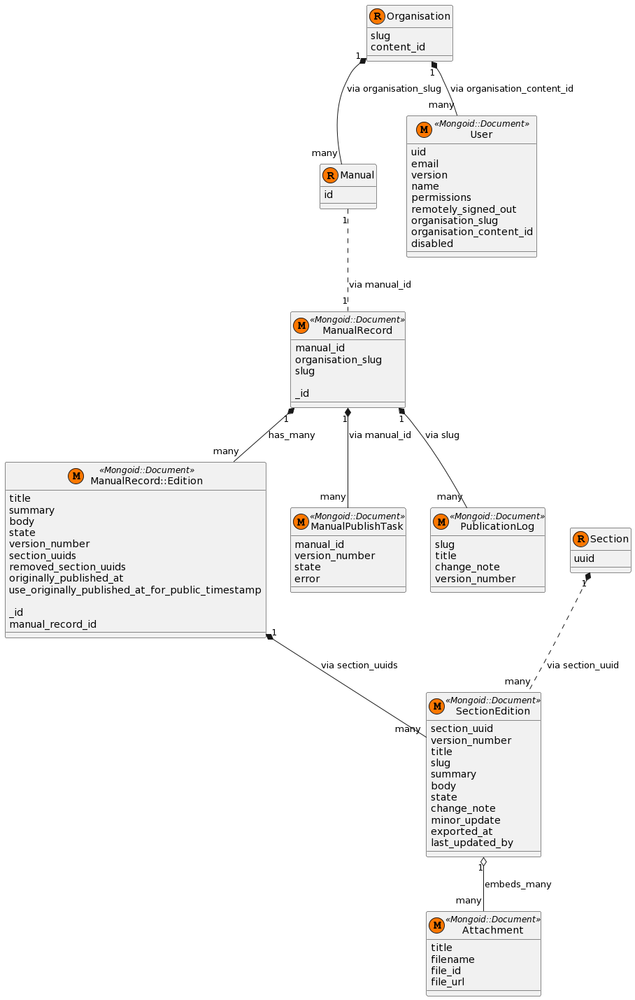

# Current state

## Overview

The purpose of the Manuals Publisher application is to allow content editors to update Manuals - a type of long-form document.

The domain model for the application is quite simple. A `Manual` is composed of many `Section`s. Both the `Manual` and the `Section` have a version history which is known in the code base as an Edition (`ManualRecord::Edition` and `SectionEdition` concretely). Looking at editions of manuals and sections allows citizens to see when a document has changed in a significant way.

Sections can have file `Attachment`s. Publishing a manual makes a call to the Publishing API (which updates the search index via Rummager). For historical reasons the application maintains its own state in MongoDB. The local state *should* reflect the state of the Publishing API's database at any particular time, although the application itself doesn't enforce this. A user of the application sees data read from the local MongoDB database, not the Publishing API.

## Models

The following diagram illustrates the associations between the models in the application

This application models the "domain" and the "persistence" for Manuals and Sections separately. Unfortunately this separation is not rigidly and consistently held throughout the application

- A "plain Ruby" class `Manual` is responsible for persisting its data into `ManualRecord` and `ManualRecord::Edition`.
- A "plain Ruby" class `Section` is responsible for persisting its data into `SectionEdition`.
- There is no section equivalent of `ManualRecord` (e.g. `SectionRecord`); the concept of a section is only persisted by one or more `SectionEdition`s having a specific `section_uuid`.
- A `SectionEdition`'s attachments are modelled using Mongoid's `embeds_many` association (in the underlying database, they are stored as a nested array of objects under `SectionEdition`).
- Some associations between objects are not modelled using Mongoid association methods (`has_many`, `embeds_many`, etc.) but rather rely on the presence of foreign keys, or arrays of foreign keys. For example the association between a `ManualRecord::Edition` and `Section` is via an array of `section_uuids`.
- It is not possible to explicitly determine which edition of a section belongs to which edition of a manual, although this can be determined implicitly for the first and last edition of a manual.

## Controllers

The application has three controllers, one for each of the main domain objects in the application - `ManualsController`, `SectionsController` and `SectionAttachmentsController`. These controllers are largely unsurprising. Most of the logic for each controller action is encapsulated in Service objects.

## Services

`Service` classes in the `app/services` directories (not to be confused with the Services module in `lib/services.rb`) contain the logic for creating and updating Mongoid models, logging events and interacting with the Publishing API.

If you need to perform an action from outside of the context of a controller, for example in a one-off Rake task, ideally you should `call` a method on a Service instance as this ensures the correct sequence of side-effects.

## Adapters

The Adapter classes encapsulate the API calls to 2 external APIs: The (version 2) [Publishing API](https://github.com/alphagov/publishing-api) and the Organisations API. These Adapters should be used in preference to making API calls directly from scripts and services.

The classes serve as application-specific wrappers around the [GDS API adapters](https://github.com/alphagov/gds-api-adapters). The idea is that methods on adapters should accept and return instances of domain models and not Hashes/JSON. The translation between domain model objects and Hashes/JSON (and vice versa) should only happen inside the adapters.

## LinkCheckerAPI

The `link-checker-api` has been integrated on the show page for both Manuals and Sections. It extracts all links from within any GovSpeak fields and sends them to the `/batch` endpoint of the API. In this request it also sends across a `webhook_callback` which then populates any information about broken/warning links. More reading about the endpoints can be found [here](https://docs.publishing.service.gov.uk/apis/link-checker-api.html)

## Rake tasks

A small number of Rake tasks exist. These perform actions that are not exposed via the user interface, or are required to be infrequently run (for example report generation). Some commonly used Rake tasks are [documented separately](rake-tasks.md).
