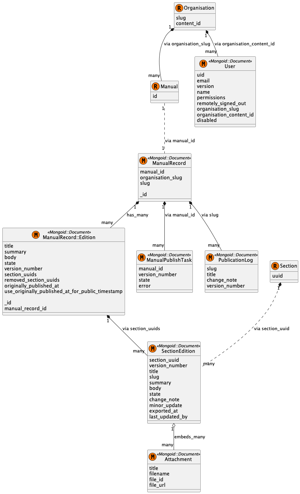

# Manuals Publisher Data Model

There are two key data objects in the Manuals Publisher application: manuals and sections. The local state *should* reflect the state of the Publishing API's database at any particular time, although this is not enforced effectively by the application.

A manual is composed of multiple sections, each of which are represented by their own page on GOV.UK. In addition to text content, sections may have binary file attachments. Both manuals and sections have editions so that users can draft new editions of the manual before publishing it to GOV.UK. You can read more about the edition workflow [here](edition-workflow.md).

Manuals Publisher is relatively unusual among GOV.UK publishing applications in that it stores data in its own instance of DocumentDB. Unlike when using Active Record, there is not a one-to-one mapping between a model class and its data store. Only model classes that extend the `Mongoid::Document` class have their own document collection in DocumentDB.

This is a class diagram of the application's model directory.

## Manuals and Sections

This application partially separates the "domain" and the "persistence" for manuals and sections, which is unusual for a GOV.UK Ruby on Rails application. A "plain Ruby" class, `Manual`, is responsible for persisting and loading `ManualRecord` and `ManualRecord::Edition` Mongo documents. Another "plain Ruby" class, `Section`, is responsible for persisting and loading `SectionEdition` Mongo documents. There isn't a Mongo document representing a section. The section is constructed in memory from one or more `SectionEdition` documents with the same `section_uuid` using the `Section.find` method.

Manuals reference their sections via a list of the sections' UUIDs stored in the `sections` attribute. The section edition does not store a reference to the parent manual, so given only a section it is not possible to access the manual. Manuals also keep a list of sections that have been withdrawn from the manual in the `removed_sections` attribute. The values of these attributes are serialised to a MongoDB array type.

Sections may have many attachments, which are not represented as a Mongo document. Instead, attachments are embedded inside each `SectionEdition` Mongo document. This means that they have to be copied across from the previous section edition when a new section edition is created.