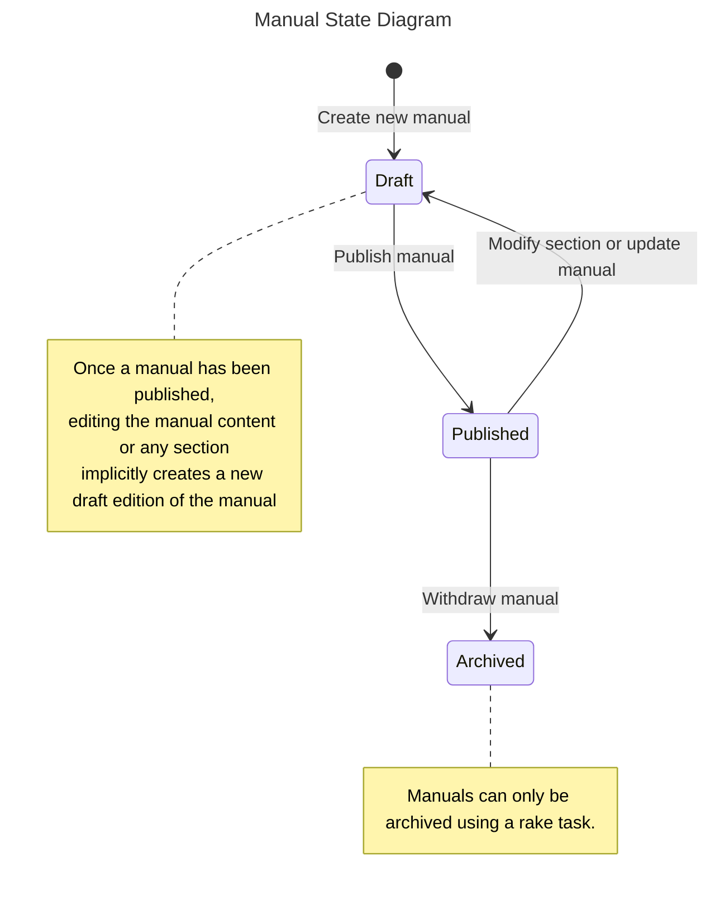
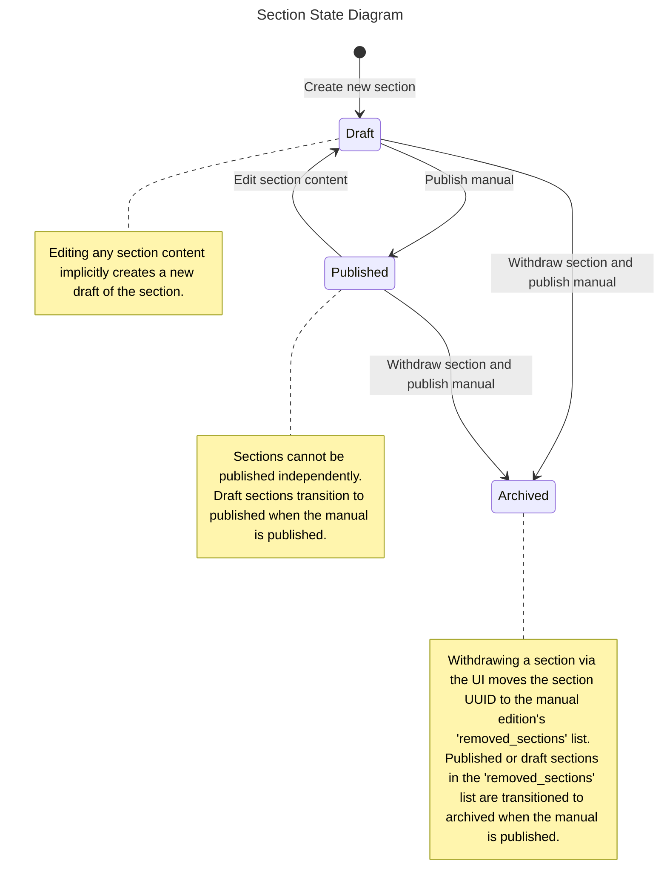

# Manuals Publisher Edition Workflow

Manuals have a complex workflow because both they and the sections they contain may have multiple editions. This makes reasoning about sections particularly difficult because some changes to the section edition state are only applied at the time the manual edition is published. This is particularly true in the case of withdrawing a section, where the section will be in the `removed_sections` list for the manual edition but will have a state of `published` until the manual edition is published. Even though the section still has the `published` state, it will not be visible in the user interface when editing the manual. Note that Manuals Publisher uses the terms `withdrawn` and `archived` interchangeably.

The other surprising aspect of Manuals Publisher workflow is that, unlike many other GOV.UK Publishing applications, there isn't a user interaction that explicitly creates a new edition of a manual or section. Instead new editions of both sections and manuals are created implicitly when a section is edited and saved.

As you can see below, the state machines themselves are relatively simple but understanding the interaction between them is tricky.

